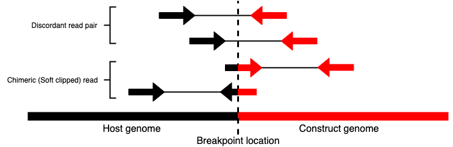

# TC_hunter

## TC-hunter identifies transgenic insertion sites within host genome

TC-hunter searches for transgenic insertion sites in a host genome and returns figures and a report to support these findings. 

There's two programs; **TC_hunter** and **TC_hunter_BWA**. 

- :green_square: **TC_hunter_BWA.nf**

TC_hunter_BWA accepts raw pair end fastq files (from one or several samples) as input and performes BWA MEM alignment before searching for trasgenic insertion site.     

- :yellow_square: **TC_hunter.nf**

Accepts one or several aligned BAM files (mapped to both host and transgenic sequence) as input. 
TC-hunter then identifies anchors and chimeric reads that maps to both host and transgenig sequence.    
  


      	          			

## Install TC-hunter 

Clone the repository from Github and put it in your path (or add the direct path to config file) 
```
$ git clone https://github.com/vborjesson/TC_hunter.git
$ export PATH="/home/yourPath/TC_hunter":$PATH
```

## Software Dependencies

In order to run TC_hunter you need to have some programs installed. Here's three options on how you can do it: 

1. Install required programs and tools using Anaconda yml-file (prefered)
```
$ conda env create --file TC_hunter/Scripts/TC_hunter.yml
$ source activate TC_hunter_v1.0
```

2. Create your own conda environment 
```
$ conda create -n TC_hunter R=3.5
$ source activate TC_hunter
$ conda install -c bioconda samtools=1.10
$ conda install -c bioconda nextflow=19.01.0
(only if runing TC_hunter_BWA) $ conda install -c bioconda bwa
$ conda install -c anaconda pandas
$ conda install -c conda-forge r-circlize
$ conda install -c r r-dplyr
$ conda install -c r r-data.table
```

3. Download manually

softwares
```
R 3.5 or higher
python 2.7
samtools 1.10 (works on other versions as well)
nextflow 19.01.0
bwa 0.7
```

R packages 
```
circlize
dplyr
data.table
```

## Run TC_hunter with test data (takes approximately 1 minute to run)

Download data
```
mkdir test_run 
cd test_run
pip install gdown # If you don't already have it installed
gdown https://drive.google.com/uc?id=1FXKJWD2yq1iUuL0lEATQ3Bqfr2vOyioK 
cp ../TC_hunter/Test_data/* .
```
Then run TC_hunter:
```
nextflow ../TC_hunter/TC_hunter.nf -c testrun.config --workingDir <realpath_to_test_run_dir> --tc_hunter_path <realpath_to_tchunter>
```

You should see TC_hunter running each process one after each other 
1. samtools_index 
2. create_links_sup
3. create_links_soft 
4. create_karyotype 
5. create_histogram 
6. create_plots 
7. create_html

When it's done check that you have an output_summary.html file. 

## Create construct.txt file (required)

In order to generate figures with construct information, you need to add this informtaion. 
Create a txt-file with gene info per line, separated by space. The info should be; 1) name, 2) start position and 3) end position. 

e.g.
```   
Amp 1 500   
lyz 1000 1200       
Gene3 2000 5000		      
Gene4 7000 7700	     		
```


## Make Configuration file 

Create a configuration file from template.
```
$ cp TC_hunter/template/TC_hunter.config /path/to/WorkingDir 
```

Add required information to config file

### TC_hunter.nf

| Argument  | Usage | Description |
| ------------- | ------------- | ------------- |
|  WorkingDir | <Path/WorkingDir>  | Path to your working directory (this is where the output html and figures will be) |
| TC_hunter_path  | <Path/TC_hunter>  | Path to TC_hunter, only TC_hunter if it's in your $PATH |
| Construct_file  | <Path/construct.txt>  | Path to your construct.txt file (See `Create construct.txt file` above) |
| Construct_length  | <Length>  | The length of your construct in numbers |
| Construct_name  | <Name>  | The name of the construct, most match the name in the reference file, no space |
| bam | <Bam_directory> | The path to the directory where you have your bam file or (if several sampes) bam files. |
| Reference | <Jointref.fa> | Path to the merged reference file including both host and construct genome. `cat host_ref construct_ref > Jointref.fa` |

e. g. [example.config](https://github.com/vborjesson/TC_hunter/blob/master/template/tchunter_example.config)

### TC_hunter_BWA.nf


| Argument  | Usage | Description |
| ------------- | ------------- | ------------- |
|  WorkingDir | <Path/WorkingDir>  | Path to your working directory (this is where the output html and figures will be) |
| TC_hunter_path  | <Path/TC_hunter>  | Path to TC_hunter, only TC_hunter if it's in your $PATH |
| Construct_file  | <Path/construct.txt>  | Path to your construct.txt file (See `Create construct.txt file` above) |
| Construct_length  | <Length>  | Length in numbers of your construct that will be plotted |
| Construct_name  | <Name>  | Name of the construct, most match the neme in your reference file |
| sample | <sample_directory> | Path to directory where you have the fastq-files (R1 and R2) |
| folder | <sample_directory> | Path to directory containing one directory for each sample. The name of the samples will be the same as the directory names |
| host_ref | <host_ref.fa> | Path to host reference file |
| construct_ref | <construct_ref.fa> | Path to construct reference file |

e. g. [example.config](https://github.com/vborjesson/TC_hunter/blob/master/template/tchunter_BWA_example.config)

## Run TC_hunter.nf

Before running, make sure you have a config file with all required information (see "Make Configuration file").  


```
$ nextflow TC_hunter.nf -c <file.config> [-with-report <report name>]
```

## Run TC_hunter_BWA.nf

Before running, make sure you have a config file with all required information (see "Make Configuration file").  


```
$ nextflow TC_hunter_BWA.nf -c <file.config> [-with-report <report name>]
```

## Run IGV separately 

In order to get the IGV figures you need to have GUI available. If not; you can run IGV separately when TC-hunter is finished. Run one .bat file for each sample.

```
$ igv.sh -b <sample_name.bat>
``` 


## Understand your output 

TC-hunter finds insertion sites based on chimeric and discordant read pair. 


TC_hunter reports each possible insertion site in an html file called ```output_summary.html```. The file contains 5 columns; 1) Ranking - best hit based on score is ranked first, second best second etc, 2) Score - Based on the number of chimeric and discordant read pairs supporting this insertion site, 3) Breakpoint host - Where in the host is this insertionsite located, 4) Breakpoint construct - Where in the construct is this insertion site located, 5) figures - three figures I) circular plot (see below), II) igv, III) igv more zoomed in. 

* output_summary.html 


For every predicted insertion site a circular figure is created. Red links, "lines" represent every discordant read pair supporting this event. Black links represent chimeric reads supporting this event.
!

## Supporting material for TC_hunter paper 

[Supporting data](https://github.com/vborjesson/TC_hunter_supplementary) 

