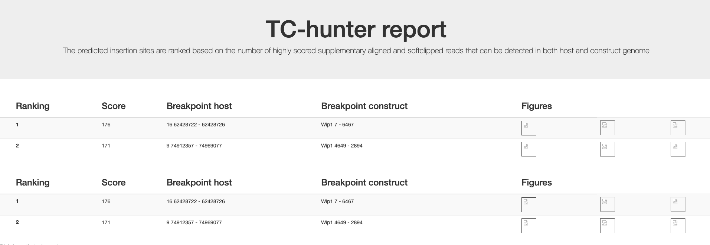

# TC_hunter

{width=50%}{width=50%}

## TC-hunter identifies transgenic insertion sites within host genome

TC-hunter searches for transgenic insertion sites in a host genome and returns figures and a report to support these findings. 

Theres two programs; TC_hunter and TC_hunter_BWA. 

## TC_hunter.nf
Accepts an aligned BAM file (mapped to both host and transgenic sequence) as input. 
TC-hunter then identifies anchors and chimeric reads that maps to both host and transgenig sequence.    

## TC_hunter_BWA.nf 

TC_hunter_BWA accepts raw pair end fastq files as inbut and performes BWA MEM alignment before searching for trasgenic insertion site.       


## Install 

Clone the repository from Github and put it in your path (or add the path to config file) 
```
git clone https://github.com/vborjesson/TC_hunter.git

```

Install required programs and tools using Anaconda
```
conda env create --file TC_hunter/Scripts/Nextflow_env.txt
```

## Configuration

Make a config file with all required information. 

### TC_hunter.nf

```
cp tc_hunter.config 
```

### TC_hunter_BWA.nf


## Run 

Before running, make sure you have a config file with all required information (see Config).  

```
nextflow TC_hunter.nf -c <file.config> [-with-report <report name>]
```


