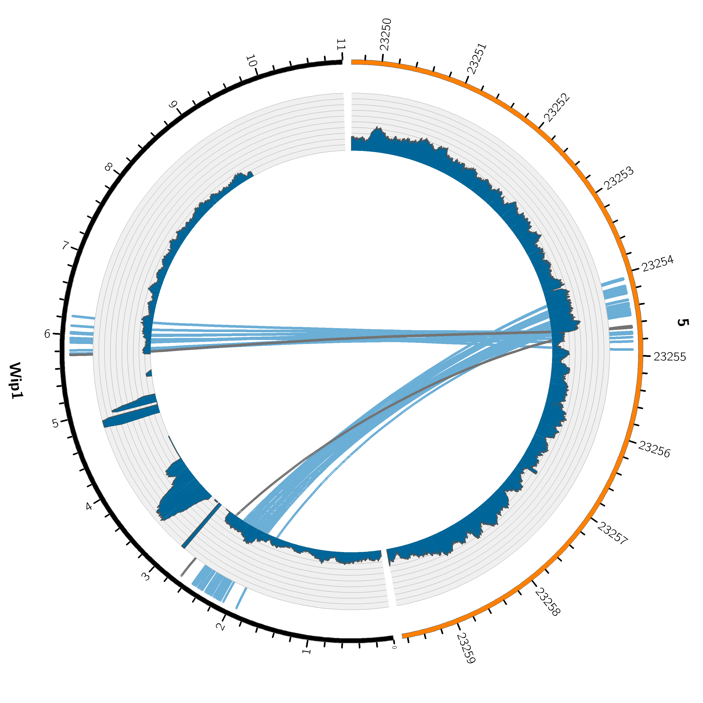

# TC_hunter

## TC-hunter identifies transgenic insertion sites within host genome

TC-hunter searches for transgenic insertion sites in a host genome and returns figures and a report to support these findings. 

Theres two programs; TC_hunter and TC_hunter_BWA. 

## TC_hunter
Accepts an aligned BAM file (mapped to both host and transgenic sequence) as input. 
TC-hunter then identifies anchors and chimeric reads that maps to both host and transgenig sequence.         


## Install 

```
git clone https://github.com/vborjesson/TC_hunter.git
```

Install required programs and tools using Anaconda
```
conda env create --file TC_hunter/Scripts/Nextflow_env.txt
```

## Run 

```
nextflow TC_hunter.nf 
```

