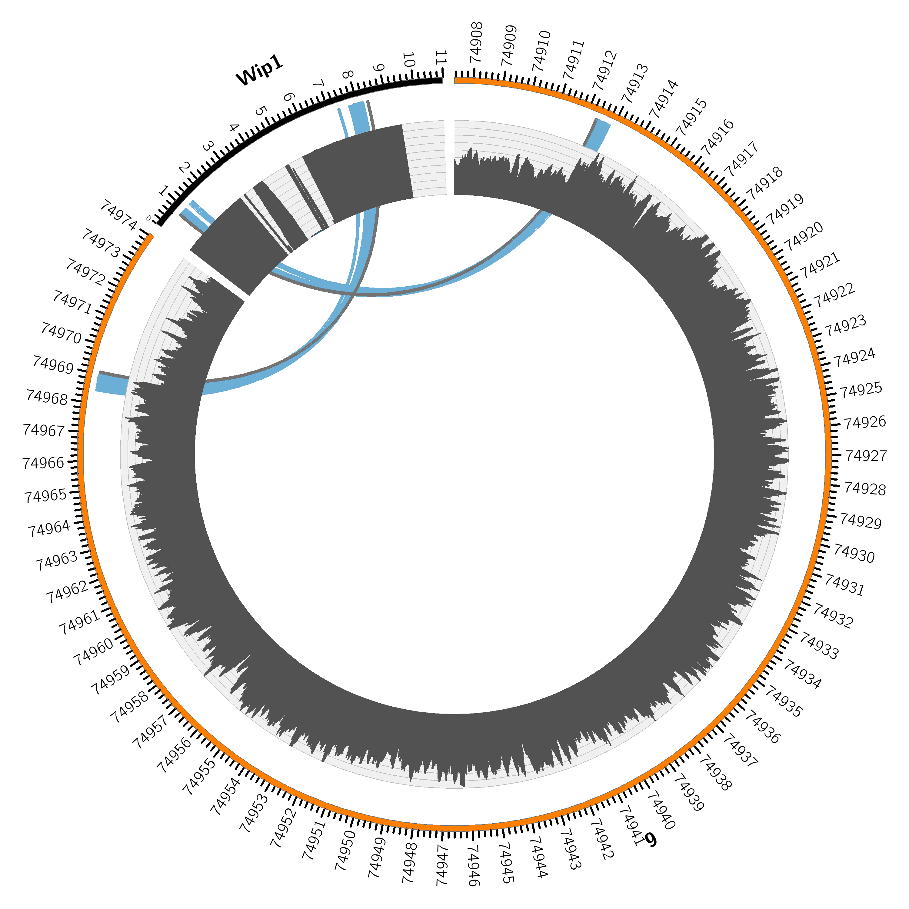

# TC_hunter

TC-hunter identifies transgenic insertion sites within host genome




## Install 

```
git clone https://github.com/vborjesson/TC_hunter.git
```

Install required programs and tools using Anaconda
```
conda env create --file TC_hunter/Scripts/Nextflow_env.txt
```

