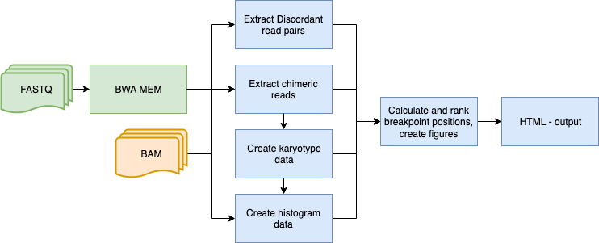

# TC_hunter

## TC-hunter identifies transgenic insertion sites within host genome

TC-hunter searches for transgenic insertion sites in a host genome and returns figures and a report to support these findings. 

Theres two programs; TC_hunter and TC_hunter_BWA. 

* TC_hunter.nf -
Accepts one or several aligned BAM files (mapped to both host and transgenic sequence) as input. 
TC-hunter then identifies anchors and chimeric reads that maps to both host and transgenig sequence.    

* TC_hunter_BWA.nf -
TC_hunter_BWA accepts raw pair end fastq files (from one or several samples) as input and performes BWA MEM alignment before searching for trasgenic insertion site.       




## Software Dependencies

Nextflow v.19.01.0
BWA MEM v.0.7.5a (only if you run TC_hunter_BWA.nf)
Samtools v.1.9
R v.3.5.1
python v.3.5.1
igv v.2.1.7 (You can choose to run this separately)

## Install TC-hunter 

Clone the repository from Github and put it in your path (or add the direct path to config file) 
```
git clone https://github.com/vborjesson/TC_hunter.git

```

Install required programs and tools using Anaconda
```
conda env create --file TC_hunter/Scripts/Nextflow_env.txt
```

## Make Configuration file 

Create a configuration file from template.
```
cp TC_hunter/template/tc_hunter.config /path/to/WorkingDir 
```

Add required information to config file
* TC_hunter.nf

| Argument  | Usage | Description |
| ------------- | ------------- | ------------- |
|  WorkingDir | <Path/WorkingDir>  | Path to your working directory (this is where the output html and figures will be) |
| TC_hunter_path  | <Path/TC_hunter>  | Path to TC_hunter, only TC_hunter if it's in your $PATH |
| Construct_file | <Path/construct.txt> | Path to your construct.txt file (See construct file below) |
| Construct_length | <Length> | The length in numbers of your construct that will be plotted |
| Construct name | <Name> | The name of your construct, most match your reference file |
| bam | <Bam_directory> | The path to the directory where you have your bam file or (if several sampes) bam files. |
| Reference | <Jointref.fa> | Path to the merged reference file including both host and construct genome |


## Run TC_hunter.nf

```
nextflow TC_hunter.nf -c <file.config> [-with-report <report name>]
```

## Run TC_hunter_BWA.nf

Before running, make sure you have a config file with all required information (see Config).  

```
nextflow TC_hunter_BWA.nf -c <file.config> [-with-report <report name>]
```

## Understand your output 


!

